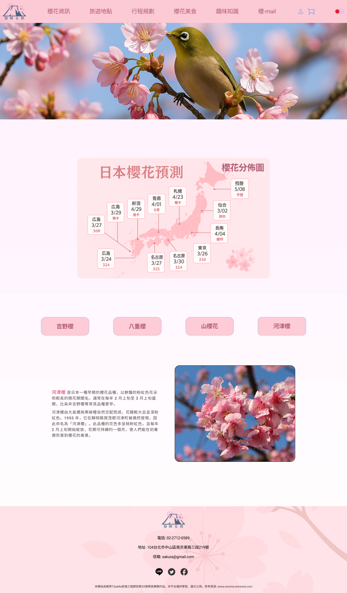
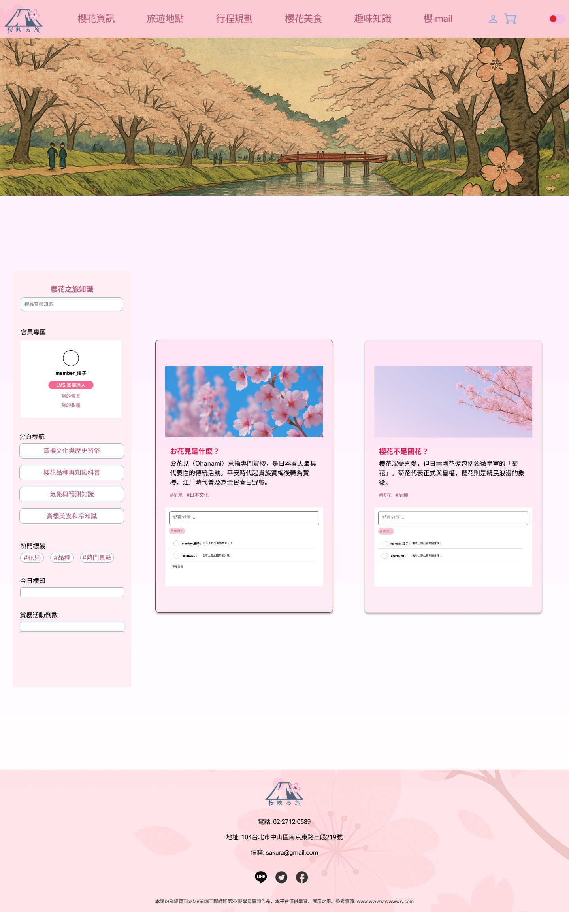

# 🌸 櫻花日本旅遊網站 (Sakura Travel)

一個以「櫻花 × 日本旅遊」為主題的靜態網站，介紹日本熱門賞櫻景點、旅遊規劃、交通方式與相關知識。網站以多頁式架構呈現，搭配互動動畫與 RWD 響應式設計，營造沉浸式的櫻花旅遊體驗。  

---

## 📌 目錄 (Table of Contents)
- [專案介紹 (About)](#-專案介紹-about)
- [功能特色 (Features)](#-功能特色-features)
- [使用技術 (Tech-Stack)](#-使用技術-tech-stack)
- [專案架構 (Project-Structure)](#-專案架構-project-structure)
- [安裝與使用 (Installation--Usage)](#-安裝與使用-installation--usage)
- [截圖展示 (Screenshots)](#-截圖展示-screenshots)
- [未來規劃 (Roadmap)](#-未來規劃-roadmap)
- [授權 (License)](#-授權-license)

---

## 📖 專案介紹 (About)

本專案為個人前端作品，主要目標：  
- 展示 **日本十大賞櫻景點** 與旅遊路線。  
- 提供購物車、票券預訂等模擬流程。  
- 融合櫻花飄落動畫與日系設計，強化網站體驗。  
- 練習多頁式 HTML 架構與 RWD 響應式切版技巧。  

---

## ✨ 功能特色 (Features)

- 🌸 **櫻花飄落動畫**：透過 JavaScript 與 CSS 實作。  
- 🗾 **旅遊景點介紹**：提供詳細的賞櫻景點與交通資訊。  
- 🛒 **購物車模擬**：支援票券加入購物車與結帳流程（前端模擬）。  
- 📱 **RWD 響應式**：針對桌機、平板與手機進行排版優化。  
- 📖 **旅遊知識補充**：包含賞櫻文化與相關資訊的頁面。  

---

## 🛠 使用技術 (Tech Stack)

**前端技術**  
- HTML、CSS、JavaScript (原生)、jQuery
- GSAP (動畫效果)  
- Splide.js (圖片輪播展示)  

**開發工具**  
- Figma (UI 設計稿)  
- GitHub (版本控制)  
- GitHub Pages (靜態部署)  

---

## 📂 專案架構 (Project Structure)

```bash
SakuraTravel/
├── index.html          # 首頁
├── index.css           # 首頁樣式
├── data-detail.js      # 資料細節 JS
├── sakurafall.html     # 櫻花飄落效果展示
│
├── Login/              # 登入頁面
├── checkout/           # 結帳頁面
├── food/               # 美食介紹
├── home/               # 首頁模組
├── information/        # 資訊頁面
├── js/                 # JavaScript 程式
├── knowledge/          # 賞櫻知識頁面
├── picture/            # 圖片展示
├── shoppingcart/       # 購物車
├── travel/             # 旅遊介紹
├── tripplanning/       # 行程規劃
│
├── css/                # 共用樣式
├── skfall.css          # 櫻花特效樣式
└── README.md
```

## 🚀 安裝與使用 (Installation & Usage)

### 方法一：直接線上瀏覽
👉 [GitHub Pages Demo](https://s86481215.github.io/SakuraTravel/)

### 方法二：本機開啟
```bash
# 1. 複製專案
git clone https://github.com/s86481215/SakuraTravel.git

# 2. 進入專案資料夾
cd SakuraTravel

# 3. 使用瀏覽器打開 index.html
```
## 📷 截圖展示 (Screenshots)

### 首頁 (Mockup)


### 櫻花介紹 (Mockup)


### 討論區 (Mockup)


## 🗺 未來規劃 (Roadmap)
```bash
- [ ] 新增會員登入 / 註冊系統
- [ ] 串接後端 API 進行票券管理
- [ ] 加入 Google Maps 彈窗導覽
- [ ] 多語系支援 (中文 / 日文 / 英文)
```

## 📜 授權 (License)
```bash
本專案僅供個人學習與作品展示使用。
```


